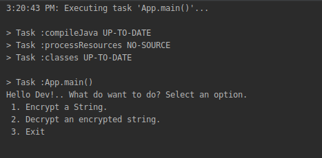
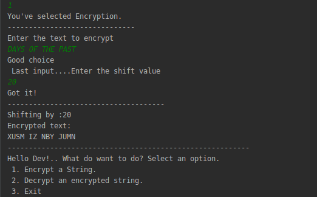
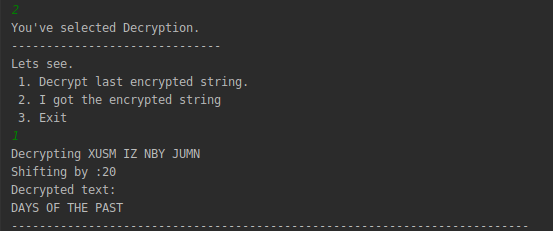

# Ceaser Cipher
Given a string of characters for example "THE QUICK BROWN FOX JUMPS OVER THE LAZY DOG" when the value used during shifting is 2 then it should return "QEB NRFZH YOLTK CLU GRJMP LSBO QEB IXWV ALD" else decrypt the latter and return the former which is "THE QUICK BROWN FOX JUMPS OVER THE LAZY DOG"

## Table of contents
* [General info](#general-info)
* [Screenshots](#screenshots)
* [Technologies](#technologies)
* [Setup](#setup)
* [Features](#features)
* [Status](#status)
* [Inspiration](#inspiration)
* [Contact](#contact)

## General info
A user is given a list of options which they are allowed to choose from. If the user selects encryption, they are asked to enter the text to be encrypted and the value thy want the letters to be shifted with. Else, if they select decryption they they are required to either choose between the already encrypted text or enter their own encrypted text. They can exit the program when they select exit option. 
## Screenshots
#####select options

#####encryption

#####decryption

## Technologies
* java- jdk11
* gradle

## Setup
* Install java preferably jdk 11
* Setup your IDE .Some great IDEs include Intellij and  netbeans.
* Clone the repository
* Open the IDE in the created directory
## Code Examples
Encryption code:

`public  String startEncryption(){
         StringBuilder encrypted= new StringBuilder();
         for(int i=0;i<sentence.length();i++) {
             int c=sentence.charAt(i);
             if(Character.isUpperCase(c)) {
                 c = c + (theKey % 26);
                 if( c> 'Z') c = c-26;
             }
             else if(Character.isLowerCase(c)) {
                 c = c + (theKey % 26);
                 if(c > 'z') c = c - 26;
             }
             encrypted.append((char) c);
         }
         return encrypted.toString();`

## Features
This application is able to: 
* Get user input
* Encrypt the text to cipher
* Decrypt the cipher to original string

## Status
Project is:  _finished_

## Inspiration
credits:
1. Ceaser Cipher

## Contact
Created by atembaemm07@gmail.com

## License
[MIT LICENCE](license)